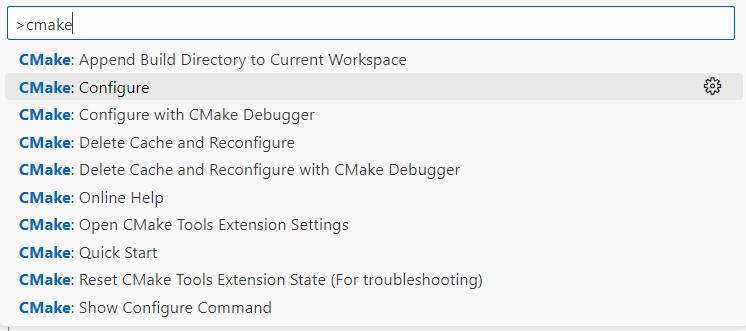
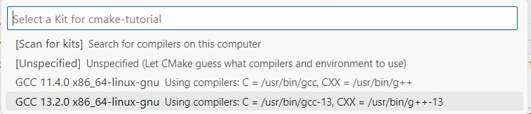
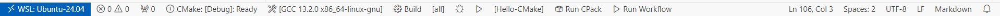

# Ep-1.1-Getting Started with CMake on Linux.

I assume all the required tools are install in Linux machine (Ubuntu 224.04) and all the Extension in VS Code.
### Now Let's start with our first "Hello CMake" project using CMake.

* First create a main.cpp file and write "Hello CMake" program
~~~
#include <iostream>
using namespace std;

int main()
{
    std::cout<<"Hello CMake..!"<<std::endl;
    return 0;
}
~~~
* and after create a file with same name: ***CMakeLists.txt*** and write CMake script to build your "Hello CMake" project. See as below your first CMake script to build your "Hello CMake" project.
~~~
cmake_minimum_required(VERSION 3.28.0)

# Define project name, it is on your choice, whatever name you want to keep.
project(Hello-CMake)

# Here I keep executable name same as project name. ${PROJECT_NAME} -> Hello-CMake
add_executable(${PROJECT_NAME} main.cpp)
~~~
Let's Understand above CMake script line-by-line.
> **cmake_minimum_required(VERSION 3.28.0)** -> Just conside this is required for all CMake project mandotry.

>**project(Hello-CMake)** -> project() is method which accept project name to set the project name. Here I keep my project name as - **Hello-CMake** which simply print "Hello CMake..!" on console.

> **add_executable(${PROJECT_NAME} main.cpp)** -> *add_executable()* is another method of CMake script, which accept two types of arguments 
* 1) executable name, here is keep executable name is same as project name- so, for that CMake scripts provided macro {PROJECT_NAME} and extract value from it use (dollar).
* 2) source file on which executable is going to create - here it is main.cpp.

Upto now your Hello-CMake project is ready to compile/build and run. Let's understand how to compile/build and run your project.

* Open terminal and go into you projet folder where is your "CMakeLists.txt" is present. in my case it is in.
  ~~~
  mna@DESKTOP-194LI0R:/mnt/d/cmake-tutorial$ ls
  Ep-1.1-Getting-Started-with-CMake-on-Linux  README.md
  mna@DESKTOP-194LI0R:/mnt/d/cmake-tutorial$ cd Ep-1.1-Getting-Started-with-CMake-on-Linux/
  mna@DESKTOP-194LI0R:/mnt/d/cmake-tutorial/Ep-1.1-Getting-Started-with-CMake-on-Linux$ ls
  CMakeLists.txt  Ep-1.1-Getting-Started-with-CMake-on-Linux.md  main.cpp
  ~~~
* and create and "build" folder in the current directory and go into that "cd build"
  ~~~
  mna@DESKTOP-194LI0R:/mnt/d/cmake-tutorial/Ep-1.1-Getting-Started-with-CMake-on-Linux$ mkdir build && cd build
  mna@DESKTOP-194LI0R:/mnt/d/cmake-tutorial/Ep-1.1-Getting-Started-with-CMake-on-Linux/build$ 
  ~~~
* Now run "cmake ../" command in build folder, here cmake is command and ../ is used to where is "CMakeLists.txt"
  ~~~
  mna@DESKTOP-194LI0R:/mnt/d/cmake-tutorial/Ep-1.1-Getting-Started-with-CMake-on-Linux/build$ cmake ../
  -- The C compiler identification is GNU 11.4.0
  -- The CXX compiler identification is GNU 11.4.0
  -- Detecting C compiler ABI info
  -- Detecting C compiler ABI info - done
  -- Check for working C compiler: /usr/bin/cc - skipped
  -- Detecting C compile features
  -- Detecting C compile features - done
  -- Detecting CXX compiler ABI info
  -- Detecting CXX compiler ABI info - done
  -- Check for working CXX compiler: /usr/bin/c++ - skipped
  -- Detecting CXX compile features
  -- Detecting CXX compile features - done
  -- Configuring done (3.3s)
  -- Generating done (0.1s)
  -- Build files have been written to: /mnt/d/cmake-tutorial/Ep-1.1-Getting-Started-with-CMake-on-Linux/build
  ~~~
* Observe in build folder, you will find a "Makefile" has been created along with multiple others files and folder. now run "make" command in build folder, and you will observe that Hello-CMake executable get created in build folder.
  ~~~
  mna@DESKTOP-194LI0R:/mnt/d/cmake-tutorial/Ep-1.1-Getting-Started-with-CMake-on-Linux/build$ make
  [ 50%] Building CXX object CMakeFiles/Hello-CMake.dir/main.cpp.o
  [100%] Linking CXX executable Hello-CMake
  [100%] Built target Hello-CMake
  ~~~
* Now run the Hello-CMake executable
  ~~~
  mna@DESKTOP-194LI0R:/mnt/d/cmake-tutorial/Ep-1.1-Getting-Started-with-CMake-on-Linux/build$ ./Hello-CMake 
  Hello CMake..!
  ~~~

### Automate with VS Code
Upto now you have compile/build and run "Hello-CMake" project manually. same process it is very easy automate with VS Code. Let's do it.

Note: To keep images I created one folder name "img".

* First clean the project folder means remove build folder 
  ~~~
  mna@DESKTOP-194LI0R:/mnt/d/cmake-tutorial/Ep-1.1-Getting-Started-with-CMake-on-Linux/build$ cd ..
  mna@DESKTOP-194LI0R:/mnt/d/cmake-tutorial/Ep-1.1-Getting-Started-with-CMake-on-Linux$ ls
  CMakeLists.txt  Ep-1.1-Getting-Started-with-CMake-on-Linux.md  build  main.cpp
  mna@DESKTOP-194LI0R:/mnt/d/cmake-tutorial/Ep-1.1-Getting-Started-with-CMake-on-Linux$ rm -rf build
  mna@DESKTOP-194LI0R:/mnt/d/cmake-tutorial/Ep-1.1-Getting-Started-with-CMake-on-Linux$ ls
  CMakeLists.txt  Ep-1.1-Getting-Started-with-CMake-on-Linux.md  main.cpp
  ~~~

* Go to the "Ep-1.1-Getting-Started-with-CMake-on-Linux" folder and press shift + ctrl + p in VSCode, it will open VSCode command prompt and search "cmake configure" see image below.
  
  

* Next select compiler, In my case I choosen "GCC 13.2.0 x86_64-linux-gnu Using compilers: C = /usr/bin/gcc-13, CXX = /usr/bin/g++-13"
  
  

* After selection of compiler, it will automatically generate build forlder for you with all compiler setting and all. for this case it is automatically fetch ninja-build, In manual case it was Unix Makefile system.
* After generating of build folder, if you observe bottom plate of VSCode, you will find all sets like Debug//Release config, Compiler, Build and Debug icon

    