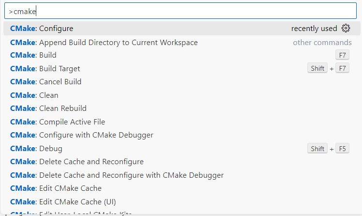

# Ep-1.2-Getting Started with CMake on Windows

After straight forward installation of CMake and tdm-gcc tool. **Only one things you need to take care of ninja build.**
* Unzip the "ninja-win.zip" and copy ninja exe to the path: "C:\Program Files\CMake\bin"

**Note:** That is only setup is required to build CMake project on windows with ninja-build.

### Now Let's start with our first "Hello CMake" project using CMake on windows.
* create main.cpp file and CMakeLists.txt file in "Ep-1.2-Ep-1.2-Getting-Started-with-CMake-on-Windows" folder.

~~~
#include <iostream>
using namespace std;

int main()
{
    std::cout<<"Hello CMake for Windows..!"<<std::endl;
    return 0;
}
~~~
and CMakeLists.txt
~~~
cmake_minimum_required(VERSION 3.28.0)
project(CMake-for-Windows)
add_executable(${PROJECT_NAME} main.cpp)
~~~

* Now, Press Shift + Ctrl + P it will apprears prompt where you need to type cmake:configue.
    
* Next it will detect compile for my case tdm-gcc 
    

### Manually - Clean and build 
Since we are using ninja build so, we execute following commands to cleand and build

~~~
**To Clean**
PS D:\cmake-tutorial\Ep-1.2-Ep-1.2-Getting-Started-with-CMake-on-Windows\build> ninja clean
[1/1] Cleaning all built files...
Cleaning... 2 files.

**To build**
PS D:\cmake-tutorial\Ep-1.2-Ep-1.2-Getting-Started-with-CMake-on-Windows\build> ninja      
[2/2] Linking CXX executable CMake-for-Windows.exe

**To run executable**
PS D:\cmake-tutorial\Ep-1.2-Ep-1.2-Getting-Started-with-CMake-on-Windows\build> .\CMake-for-Windows.exe
Hello CMake for Windows..!
~~~