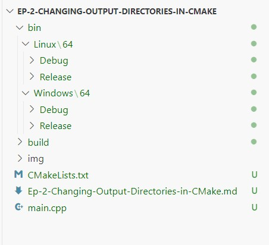

# Ep-2-Changing Output Directories in CMake

Here is bare minimum set for creating and executable in build directories.

main.cpp
~~~
#include <iostream>
using namespace std;

int main()
{
    std::cout<<"Hello CMake for Windows..!"<<std::endl;
    return 0;
}
~~~
CMakeLists.txt
~~~
cmake_minimum_required(VERSION 3.28.0)
project(Change-Output-Directories)
add_executable(${PROJECT_NAME} main.cpp)
~~~

But, we want to create executable in "bin" forlder with OS dependent and 64x/86x and Debug/Release configuration.

**../bin/(Linux/Windows/Apple)/)(64x/32x)/(Debug/Release)**

### OSBitness
To achive above requirements, We have to identify OSBitness and set it. See how we can identify OSBitness.

~~~
set(OSBitness 32)
if(CMAKE_SIZEOF_VOID_P EQUAL 8)
    set(OSBitness 64)
endif()
~~~

Let's create a variable name as "FullOutputDir"
~~~
set(FullOutputDir ${CMAKE_SOURCE_DIR}/bin/${CMAKE_SYSTEM_NAME}/${OSBitness}/${CMAKE_BUILD_TYPE})
~~~
Now, Let's understand about each macro's it has been use in.

~~~
${CMAKE_SOURCE_DIR}: it will detect source directory, In my case, source file are in  "Ep-2-Changing-Output-Directories-in-CMake"
~~~

~~~
${CMAKE_SYSTEM_NAME}: it will identify whether code is compiling on Linux/Windows/MacOS
~~~

~~~
${OSBitness}: OS Bitness whether x64/x86
~~~

~~~
${CMAKE_BUILD_TYPE}: It will identify whether it is debug or release build.
~~~

After that, we have to set "CMAKE_RUNTIME_OUTPUT_DIRECTORY" as  "FullOutputDir" and add_executable(- -)
~~~
set(CMAKE_RUNTIME_OUTPUT_DIRECTORY "${FullOutputDir}")
add_executable(${PROJECT_NAME} main.cpp)
~~~

Let's have look complete CMakeLists.txt for **../bin/(Linux/Windows/Apple)/)(64x/32x)/(Debug/Release)**

~~~
cmake_minimum_required(VERSION 3.28.0)
project(Change-Output-Directories)

# Identify OSBitness
set(OSBitness 32)
if(CMAKE_SIZEOF_VOID_P EQUAL 8)
    set(OSBitness 64)
endif()

# Let create a variable as FullOutputDir
set(FullOutputDir ${CMAKE_SOURCE_DIR}/bin/${CMAKE_SYSTEM_NAME}/${OSBitness}/${CMAKE_BUILD_TYPE})
set(CMAKE_RUNTIME_OUTPUT_DIRECTORY "${FullOutputDir}")

add_executable(${PROJECT_NAME} main.cpp)
~~~

Let's Compile/build and run on Linux and Windows platform and see result. 

