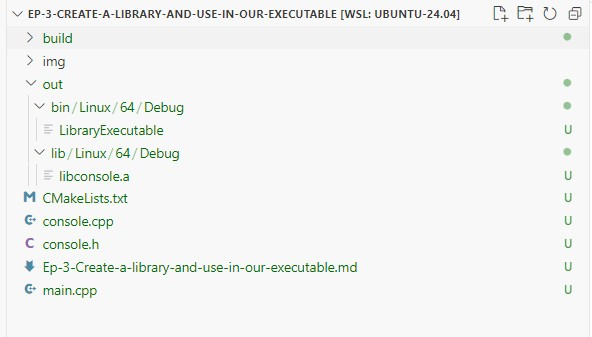

# Ep-3-Create a library and use in our executable

In this tutorial we will learn how we create static library(*.a on Linux and *.lib on Windows). before proceeding let's have look previous "CMakeLists.txt" file of Ep-2. 

~~~
cmake_minimum_required(VERSION 3.28.0)
# define project name
project(Change-Output-Directories)

# Identify OSBitness
set(OSBitness 32)
if(CMAKE_SIZEOF_VOID_P EQUAL 8)
    set(OSBitness 64)
endif()

# Lets define Executable ouput directory, ExeOutputDir -> SourceDir/bin/(Linux/Windows/MacOS)/(64/32)/(Debug/Release)
set(ExeOutputDir ${CMAKE_SOURCE_DIR}/bin/${CMAKE_SYSTEM_NAME}/${OSBitness}/${CMAKE_BUILD_TYPE})
set(CMAKE_RUNTIME_OUTPUT_DIRECTORY "${ExeOutputDir}")

# Create executable same as project name.
add_executable(${PROJECT_NAME} main.cpp)
~~~

In above CMake script, We define ExeOutputDir -> SourceDir/bin/(Linux/Windows/MacOS)/(64/32)/(Debug/Release) and set ExeOutputDir to CMAKE_RUNTIME_OUTPUT_DIRECTORY. without doing this we can not get excutable to the define path. 

Now. Simillarly, We need to define Library output directory and create library using add_library() command and then link that library to the executaable. 

Let's see with example - I define class name "console" which having one print() method in it. purpose of this is to create console library. 

console.h
~~~
#ifndef __CONSOLE_H__
#define __CONSILE___
class console
{
    public:
        static void print(const char* text);
};
#endif //__CONSILE___
~~~
console.cpp
~~~
#include "console.h"
#include <iostream>

void console::print(const char* text)
{
    std::cout<<text<<std::endl;
}
~~~

Now, Let's see "CMakeLists.txt" file in how library and executable is created and link together (Here library is static library *.a Linux and *.lib Windows)

CMakeLists.txt
~~~
cmake_minimum_required(VERSION 3.28.0)

# (1) define project name
project(LibraryExecutable)

# (2) set OSBitness
set(OSBitness 32)
if(CMAKE_SIZEOF_VOID_P EQUAL 8)
    set(OSBitness 64)
endif()

# (3) define executable output directory ExeFullOutputDir -> SourceDir/out/bin/(Linux/Windows/MacOs)/(x64/x86)/(Debug/Release)
set(ExeFullOutputDir ${CMAKE_SOURCE_DIR}/out/bin/${CMAKE_SYSTEM_NAME}/${OSBitness}/${CMAKE_BUILD_TYPE})
set(CMAKE_RUNTIME_OUTPUT_DIRECTORY ${ExeFullOutputDir})

# (4) define libarary output directory -> sourceDir/out/lib/(Linux/Windows/MacOs)/(x64/x86)/(Debug/Release)
set(LibOutputDir ${CMAKE_SOURCE_DIR}/out/lib/${CMAKE_SYSTEM_NAME}/${OSBitness}/${CMAKE_BUILD_TYPE})
set(CMAKE_ARCHIVE_OUTPUT_DIRECTORY ${LibOutputDir})

# (5) include hederfile directories
include_directories(${CMAKE_SOURCE_DIR})

# (6) Create library 
add_library(console ${CMAKE_SOURCE_DIR}/console.cpp)

# (7) Create Executable 
add_executable(${PROJECT_NAME} ${CMAKE_SOURCE_DIR}/main.cpp)

# (8) Linking library to executable
target_link_libraries(${PROJECT_NAME} console)
~~~

Let's analyze - cmake_minimum_required() is mandatory for any CMake project, next I define executable name as "LibraryExecutable" and then define OSBitness which we learn earlier. 

After that, I define executable output directory "ExeFullOutputDir" and set it to CMAKE_RUNTIME_OUTPUT_DIRECTORY, without doing this executable will not generate at define directory. and next I define library output directory "LibOutputDir" and set it to CMAKE_ARCHIVE_OUTPUT_DIRECTORY to generate library to define output directory. 

Before, creating library, we need to include headerfile and then create library.

Include headers
~~~
include_directories(${CMAKE_SOURCE_DIR})
~~~

Create library as name console
~~~
add_library(console ${CMAKE_SOURCE_DIR}/console.cpp)
~~~

Then now, create executable and link library to executable.

~~~
add_library(console ${CMAKE_SOURCE_DIR}/console.cpp)
~~~

Link console library to executable

~~~
target_link_libraries(${PROJECT_NAME} console)
~~~

#### See output final result:
