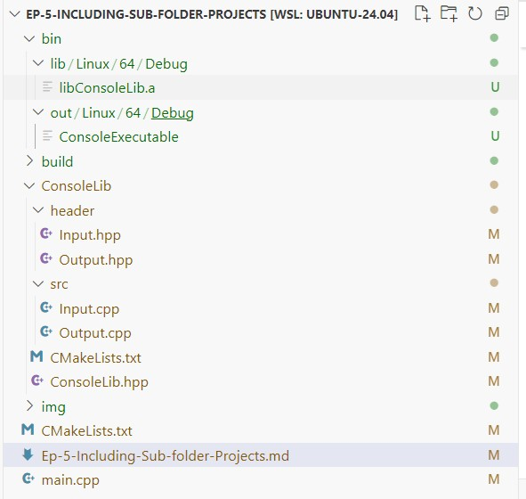

# Ep-5-Including Sub folder Projects

Till now, we have created executable or library (which is consume by executable) with one folder, means library's console.h and console.cpp  and main.cpp files are present in same folder named as "Ep-3-Create-a-library-and-use-in-our-executable". Which we learned in: [Ep-3-Create-a-library-and-use-in-our-executable](../Ep-3-Create-a-library-and-use-in-our-executable/Ep-3-Create-a-library-and-use-in-our-executable.md)

Now, I am thinking and planing - since we create console as static library and comsume by executable, so, why not keep all the *.cpp and *.h file in one library folder name as - "ConsoleLib". 
~~~
Ep-5-Including-Sub-folder-Projects  (Project folder)
    --- ConsoleLib                  (Library folder)
            ---header               (Library header folder))
                *.h
            ---src                  (Library src folder)
                *.cpp
            CMakeLists.txt
        main.cpp
        CMakeLists.txt
~~~

> Library file *.a get generated in "SourceDir/bin/lib/(Linux/Windows/MacOs)/(x64/x86)/(Debug/Release)"

> and executable get generate in SourceDir/bin/out/(Linux/Windows/MacOs)/(x64/x86)/(Debug/Release) 

and executable consume the library to use there functionality. 

See finall output: 

ConsoleLib -> CMakeLists.tx
~~~
cmake_minimum_required(VERSION 3.20.0)

# define libaray name as ConsoleLib
project(ConsoleLib VERSION 1.0.0)

# define OSbitness
set(OSBitness 32)
if(CMAKE_SIZEOF_VOID_P EQUAL 8)
    set(OSBitness 64)
endif()

# define library OutputDir - "SourceDir/out/li/(Linux/Windows/MacOs)/(x64/x86)/(Debug/Release)"
set(OutputDirlib ${CMAKE_SOURCE_DIR}/bin/lib/${CMAKE_SYSTEM_NAME}/${OSBitness}/${CMAKE_BUILD_TYPE})

# set OutputDirlib to CMAKE_ARCHIVE_OUTPUT_DIRECTORY
set(CMAKE_ARCHIVE_OUTPUT_DIRECTORY ${OutputDirlib})

# include header directory 
include_directories(header)

# Create static library name as "ConsoleLib" based on src/Input.cpp src/Output.cpp
add_library(${PROJECT_NAME} src/Input.cpp src/Output.cpp)
~~~

ConsoleExecutable -> CMakeLists.tx
~~~
cmake_minimum_required(VERSION 3.20.0)

# define project name which is executable which consume library
project(ConsoleExecutable VERSION 1.0.0)

# define OSBitness
# define OSbitness
set(OSBitness 32)
if(CMAKE_SIZEOF_VOID_P EQUAL 8)
    set(OSBitness 64)
endif()

# define executable OutputDirExe - "SourceDir/out/li/(Linux/Windows/MacOs)/(x64/x86)/(Debug/Release)"
set(OutputDirExe ${CMAKE_SOURCE_DIR}/bin/out/${CMAKE_SYSTEM_NAME}/${OSBitness}/${CMAKE_BUILD_TYPE})

# set OutputDirExe to CMAKE_RUNTIME_OUTPUT_DIRECTORY
set(CMAKE_RUNTIME_OUTPUT_DIRECTORY ${OutputDirExe})

# define subdirectory
add_subdirectory(ConsoleLib)

# define include directory
include_directories(ConsoleLib)

# create executabel same name as project name
add_executable(${PROJECT_NAME} main.cpp)

# link library to executable.
target_link_libraries(${PROJECT_NAME} ConsoleLib)
~~~