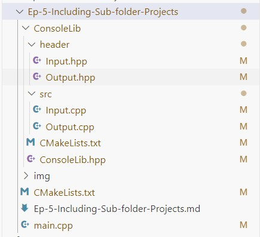
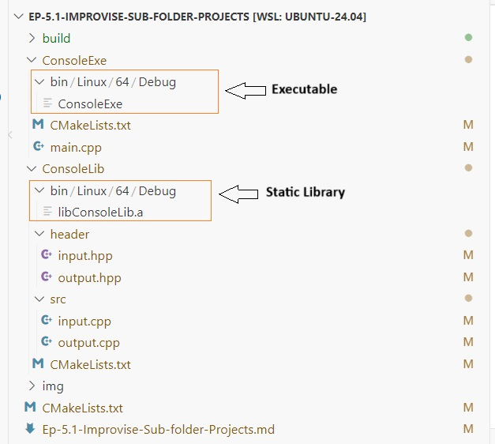

# cmake-tutorial
## Ep-1.1-Getting Started with CMake on Linux.
### Tools required getting started CMake on Linux.
below tools should be install in your Linux machine, In my case I am using WSL-Ubuntu 24.04
* build-essential
* g++
* gdb
* cmake
* ninja-build

To install above tool, please open Ubuntu 24.04 terminal (I prefer Ubuntu 24.04 LTS on WSL) or same terminal you can open through VS Code and run following command.
> $sudo apt install build-essential g++ gdb cmake ninja-build

After installation please verify all the install tool as following
> $g++ --version
```
g++ (Ubuntu 11.4.0-9ubuntu1) 11.4.0
Copyright (C) 2021 Free Software Foundation, Inc.
This is free software; see the source for copying conditions.  There is NO
warranty; not even for MERCHANTABILITY or FITNESS FOR A PARTICULAR PURPOSE.
```
> $gdb --version
```
GNU gdb (Ubuntu 15.0.50.20240403-0ubuntu1) 15.0.50.20240403-git
Copyright (C) 2024 Free Software Foundation, Inc.
License GPLv3+: GNU GPL version 3 or later <http://gnu.org/licenses/gpl.html>
This is free software: you are free to change and redistribute it.
There is NO WARRANTY, to the extent permitted by law.
```
> $cmake --version
~~~
cmake version 3.28.3
CMake suite maintained and supported by Kitware (kitware.com/cmake).
~~~
> $ninja --version
~~~
1.11.1
~~~
and below Extension should be install in Visual Studio Code and make sure it is install. it's very easy to do that.
* C/C++
* C/C++ Extension Pack
* C/C++ Themes
* CMake
* CMake Tools

Rest tutorial - [Ep-1.1-Getting-Started-with-CMake-on-Linux](Ep-1.1-Getting-Started-with-CMake-on-Linux/Ep-1.1-Getting-Started-with-CMake-on-Linux.md)

## Ep-1.2-Getting Started with CMake on Windows.
### Tools required getting started CMake on Windows.

Please download following tools and install in your windows machine.
* CMake Windows x64 Installer: https://github.com/Kitware/CMake/releases/download/v3.31.0-rc3/cmake-3.31.0-rc3-windows-x86_64.msi
* Ninja-build: https://ninja-build.org/ or https://github.com/ninja-build/ninja/releases
* tdm gcc: https://jmeubank.github.io/tdm-gcc/ or https://jmeubank.github.io/tdm-gcc/download/

Windows tutorial - [teEp-1.2-Ep-1.2-Getting-Started-with-CMake-on-Windows](Ep-1.2-Ep-1.2-Getting-Started-with-CMake-on-Windows/Ep-1.2-Ep-1.2-Getting-Started-with-CMake-on-Windows.md)

## Ep-2-Changing Output Directories in CMake
Tutorial for changing output directories- [Ep-2-Changing-Output-Directories-in-CMake](Ep-2-Changing-Output-Directories-in-CMake/Ep-2-Changing-Output-Directories-in-CMake.md)

## Ep-3-Create a library and use in our executable
Here, we wil learn how to create static library and use in executable. 

Tutorial for creating library and use it in our executable- [Tutorial for creating library and use it in our executable](Ep-3-Create-a-library-and-use-in-our-executable/Ep-3-Create-a-library-and-use-in-our-executable.md)

## Ep-5-Including Sub folder Projects
In this tutorial, we will learn how to include sub-folder in project. To learn this, I plan it as I will create "ConsoleLib" static library into a separate folder and I will consume this library into executable.  ConsoleLib folder contain "header" and "src" sub folder in it. Please see image below


Please refer link to learn more: [Ep-5-Including-Sub-folder-Projects](Ep-5-Including-Sub-folder-Projects/Ep-5-Including-Sub-folder-Projects.md)


## Ep-5.1-Improvise-Sub-folder-Projects
In this tutorial, I have created separate folder for exxecutable and library project and and Utilize passing variables from one CMakeLists.txt to another CMakeLists.txt. However CMake script is not very much optimize. I will optimize it probably in next chapter Ep-5.2.



To read it more please follow the link:- [Ep-5.1-Improvise-Sub-folder-Projects](Ep-5.1-Improvise-Sub-folder-Projects/Ep-5.1-Improvise-Sub-folder-Projects.md)